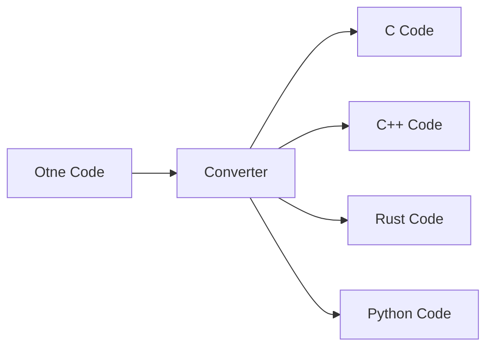

# 0.0.1-alpha
- [x] Interpreter
- [ ] Compiler

# 0.0.2-alpha
- [ ] Converter：C、C++、rust、python、

```mermaid

graph LR;
    Otne["Otne Code"]--> Converter;
    Converter --> C["C Code"];
    Converter --> C++["C++ Code"];
    Converter --> Rust["Rust Code"];
    Converter --> Python["Python Code"];

```

